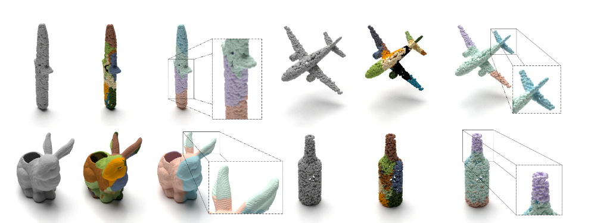
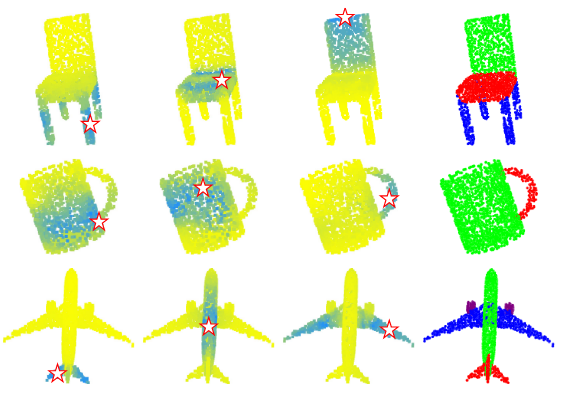
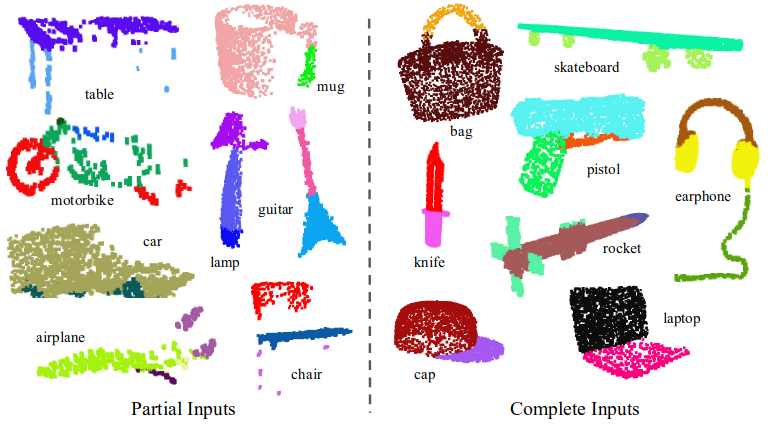
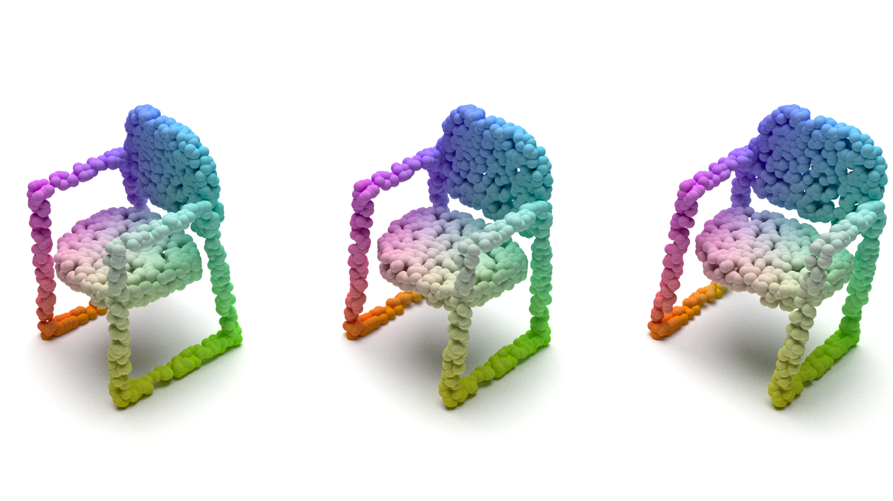
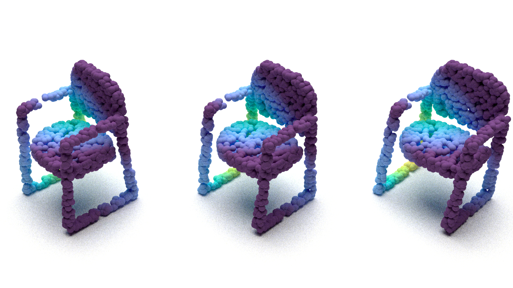

# Point Cloud Renderer

What Makes Your Academic Paper/Report Beautiful! This is a demo/utility script use to render a point cloud, with integrated mitsuba2 python API. Here are some comparisons following (compare visualizations only, these are all nice work):

|  |  |
|:-------------------------------------------------:|:------------------------------------------------:|

|  |  |
|:-----------------------------------------------:|:-----------------------------------------------:|


# Preparation

Tested version:

* Misuba >= 2.0.0
* Python 3.7

python dependency:

* argparse
* numpy
* pythonlib
* matplotlib

Please follow [this guid](https://mitsuba2.readthedocs.io/en/latest/src/getting_started/compiling.html#linux) to install `misuba` and make sure it is installed before further step.


# Quick Demo

```bash
source YOUR_PATH_TO_MITSUBA2/setpath.sh 
python point_render.py -f chair_pcl.npy
```

than a image file named `output.jpg` can be found in current fold:


It appears to contain a lot of noise. you can specify a larger sample times to smooth, but it will take more time to render:

```
python points_renderer.py -f chair_pcl.npy -s 256
```



# Getting Started

All you need to do is provide a point cloud in `.npy` form with shape `[num_pts,3 coords(+3 colors(+1 size))]`, generated from numpy, and run this script. Here are some tips:

* `-f` to specify the path to your points file.

* `-o` to specify the output filename of the render result.

* `-s` to specify the sampling time for sampler

* `-x` to specify the `xml` file to be render. This will ignore the `-f` option.

* `-c` to specify the color mapping. The given `.npy` file contain no colors will be colored by the `matplotlib.colors.Colormap` specified by this option, like `'turbo'`.

  

* `-v` to specify a specific mitsuba variant, default to "scalar_spectral".


## How to modify this script

### Preliminary

First of all, you should know something about how to describe a scene in `mitsuba`. In fact, `mitsuba` describe scene use `xml` file. please refere [here](https://mitsuba2.readthedocs.io/en/latest/src/getting_started/file_format.html) for details. Next I assume you already know some basics knowledge about it, i.e., `scene`, `intergrater`, `sampler`, `emitters` and `shape`.

Rather than using `xml` file, we use mitsuba's python interface directly to load object from python `dict`.  By this way, a more programmer way, we can easily operate objects rather than click down and up on GUI.

This only requires a few conversions betwee their, refering to [here](https://mitsuba2.readthedocs.io/en/latest/src/python_interface/parsing_xml.html). Some examples of conversions are listed below:

* A tag with "name" can be treated as a field: `<type name="a" value=b` => `"a":type(b)`. e.g:

  ```xml
  <float name="height" value="123"> 
  <string name="height" value="123"> 
  <tranform name="to_world"> 
      <scale value="2, 1, -1" /> 
      <translate value="-1, 3, 4"/>
  </transform>
  <rgb name="radiance" value="100,400,100"/>
  ```

  =>

  ```python
  "height": 123
  "height": "123"
  "to_world": ScalarTransform4f.translate([-1, 3, 4]) * ScalarTransform4f.scale([2, 2, -1])
  "radiance": { "type": "rgb","value": [100, 400, 100]}
  ```

* a tag with "type" is a plugin in mistuba: `<class type="a"> ... </class>` =>`{ "type":"a",...}`. e.g:

  ```xml
  <shape type="sphere">
      <float name="radius" value="10"/>
  </shape>
  ```

  =>

  ```python
  {  # this brackets cannot be discarded. since obly a dict contain "type" key is treatde as a plugin.
      "type" : "sphere",
  	"radius": 10
  },
  ```

for more properties of plugins please refer this [link](https://mitsuba2.readthedocs.io/en/latest/src/plugin_reference/intro.html).

### To Modify

* to add other types of data like `mesh`, please refer function `create_objects`.
* to move shadow, please refer function `create_ground` or remove it from `objs = {"ground_plane": create_ground(), }`.
* to adjust the camara view, please refer `camera` in function `create_environment`. 
* ...


# Known Problems

* fail to use `gpu` variant for rendering, because a  `GPU out of memory`  error occurred. 
* At the moment I don't know how to render a animation, maybe only remde frame by frame, since I am also new to `mitsuba`. If you get it, please feel free to let me know.


# Acknowledge

This script deeply based on[Mitsuba2PointCloudRenderer](https://github.com/tolgabirdal/Mitsuba2PointCloudRenderer) and [PointFlowRenderer](https://github.com/zekunhao1995/PointFlowRenderer) and is an easy-to-use version.
