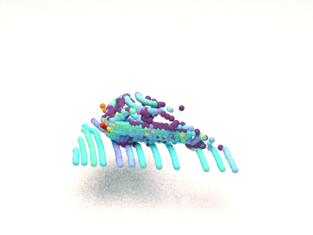
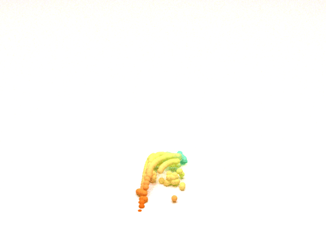

# Point Cloud Renderer


# Update
* 2023-03-10: 
  * Currently, it is compatible with mitsuba3. 
  * Support GIF recording for moving views or points. 

# Preparation

`pip install -r requirements.txt`
 


## Preliminary

* point cloud format： the extension is `npy` (saved by numpy ), storing a list of [x,y,z,...]. 
* coordinate definition: 
  * left: x
  * up:z
  * screen facing out: y

[//]: # (漫反射)

[//]: # (<bsdf type="diffuse" id="red">)

[//]: # (<rgb name="reflectance" value="0.570068, 0.0430135, 0.0443706"/>)

[//]: # (</bsdf>)

[//]: # (透明)

[//]: # (<bsdf type="dielectric" id="glass"/>)

[//]: # (反光)

[//]: # (<bsdf type="conductor" id="mirror"/>)
## single image rendering


```shell
python scripts/once.py \
-f workspace/demo/car.npy \             
-o ./workspace/demo/results/car_single \ 
--format xyzi \   
--color_by i --color_normalize \
--pose 0 0 0 0 0 -180
--preview 
```
arguments:
* -f: path to input point cloud
* -o: path to output image 
* --format: the format of the given point cloud, e.g., xyz/xyzi/xyzrgbs/...
* --color_by: which data field is used to render colors when the point cloud file does not provide rgb field for each point.
* --color_normalize: normalize color_by
* --pose: the pose [x y z r p y] of the given points (in degrees). 
* --preview: for quickly rendering. 

besides, you can modify the config file `config.yaml` to adjust the size of images or other parameters of the renderer:
* sample: sample per pixel, the higher, the better rendering quality.

## a rotating object


```shell
python scripts/anim_obj_axis.py \
-f workspace/demo/car.npy \
-o ./workspace/demo/results/car_rot_z \
--pose 0 0 0 0 0 -180 \
--axis 3 0 360 5 \
--fps 15
```
arguments:
* -axis: [axis order(x:1,y:2,z:3), begin, end ,interval]
* -fps: the frames per second for gif animation.

## given pose list


```shell
python scripts/anim_obj.py \
-f workspace/demo/car.npy \
-o ./workspace/demo/results/car_rot_z \
--pose 0 0 0 0 0 -180 \
--pose_file ./workspace/demo/poses.txt  \
--fps 15
```

## traveling in scene


```shell
python scripts/anim_view.py \
-f workspace/demo/car.npy \
-o ./workspace/demo/results/car_views \
--pose 0 0 0 0 0 -180 \
--view_file ./workspace/demo/views.txt  \
--fps 2
```

arguments:
* --view_file: store a list of (camera_x,camera_y,camera_z,target_x,targe_y,targe_z)

# Further development
1. The official reference link is given inline the code about scene definition. 
2. Edit the scene: [ref](git@github.com:OuyangJunyuan/PointCloudRenderer.git)
3. for more properties of plugins please refer
this [link](https://mitsuba.readthedocs.io/en/stable/src/rendering_tutorials.html).

# Acknowledge

This script deeply based on[Mitsuba2PointCloudRenderer](https://github.com/tolgabirdal/Mitsuba2PointCloudRenderer) and [PointFlowRenderer](https://github.com/zekunhao1995/PointFlowRenderer) and is an easy-to-use version.


